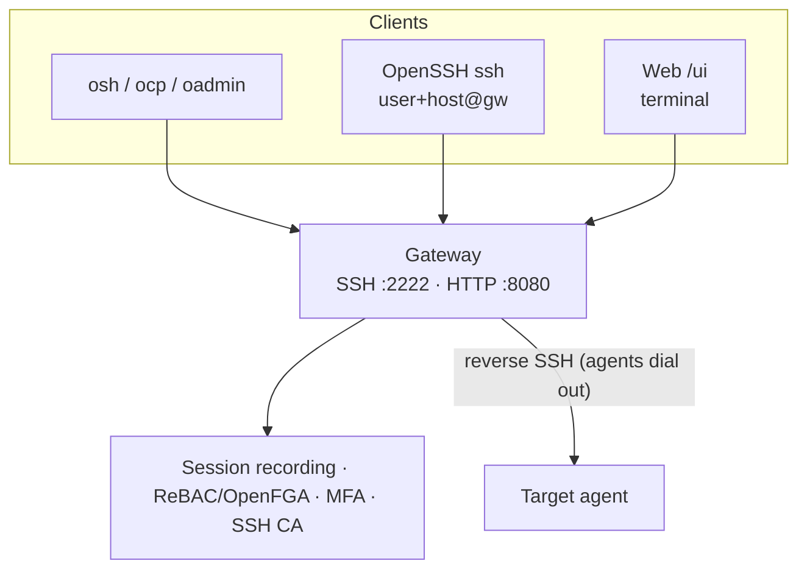

# Orion Belt

[](https://orion-belt.dev)
[](https://discord.gg/w62S8jxTHJ)
[](LICENSE)
[](go.mod)
[](https://github.com/orion-belt-dev/orion-belt/releases)
[](https://github.com/orion-belt-dev/orion-belt/actions)

Orion Belt is a self-hosted SSH access gateway with privileged access management (PAM) workflows. Agents on your servers connect out to the gateway over reverse SSH, so targets need no inbound ports. The gateway adds session recording and live watch, just-in-time access with approvals, MFA and WebAuthn, relationship-based access control (ReBAC), and an optional SSH certificate authority.

> Version 1.0.0 is stable. Orion Belt is free to self-host and use internally under [Apache 2.0 with the Commons Clause](LICENSE); it may not be sold as a product or hosted service. See [orion-belt.dev](https://orion-belt.dev) for details.


## Why Orion Belt

- Self-hosted, with no SaaS dependency.
- Agents connect out over reverse SSH, so target hosts need no inbound firewall rules.
- Every session is recorded and can be watched live.
- Just-in-time access with approvals from the console, the API, or chat (ChatOps).
- MFA with TOTP and WebAuthn.
- ReBAC authorization, optionally backed by OpenFGA.
- Optional SSH certificate authority.
- Linux packages for deb, rpm and apk distributions.

## Orion Belt in Action


## Try Orion Belt in 10 minutes

The quickstart brings up a gateway and a connected agent, opens a shell through
it, and records the session. It needs only Docker.

```bash
git clone https://github.com/orion-belt-dev/orion-belt.git
cd orion-belt
./scripts/docker-quickstart.sh
```

The script generates its own secrets, starts the gateway, creates your admin
user, registers a demo machine (`lab-1`), and prints a link that signs you in to
the console. Then, in the console:

1. Open **Machines**, select **lab-1**, open the web terminal, and run a few commands.
2. Open **Sessions** and select **Playback** to replay what you just did.

From a terminal instead: `./bin/osh -c client.yaml root@lab-1`

Stop everything with `./scripts/docker-quickstart.sh --down`.

For the full walkthrough, including an agent on a real machine, see
[Try Orion Belt in 10 minutes](docs/TRY_IN_10_MINUTES.md).

## Orion Belt vs alternatives

| | Orion Belt | Teleport | Boundary | Traditional bastion |
| --- | --- | --- | --- | --- |
| Scope | SSH-focused PAM / bastion | Broad zero-trust platform | Credential brokering / sessions | Jump host |
| Deploy | Self-hosted, Linux-first | Self-hosted or cloud | Self-hosted or HCP | DIY |
| Target reach | Agents dial out (no inbound on hosts) | Node agents / reverse tunnels | Workers / proxies | Inbound to bastion, often to hosts too |
| Session recording | Yes, with live watch | Yes | Yes (with workers) | Usually custom or none |
| JIT approvals | Built in, with ChatOps | Yes | Via workflows / IdP | Rarely |
| Weight | Lighter SSH PAM slice | Large platform | Identity-centric | Minimal features |

Orion Belt fits teams that want to run their own SSH access management without exposing SSH on every host or operating a platform the size of Teleport.

## Features

- **Gateway:** SSH and SCP proxy with recording, ReBAC, MFA and an optional SSH CA.
- **Agents:** connect out over reverse SSH; targets need no inbound ports.
- **Clients:** `osh`, `ocp` and `oadmin`, or standard OpenSSH (`user+machine@gateway`).
- **Just-in-time access:** request, approve, and receive a time-limited grant from the console, the API, or Slack, Discord, Teams and Rocket.Chat.
- **Web console:** terminal, file browser, session playback and live watch, and management of users, machines and permissions.
- **Usage dashboard:** access volume, approval latency and most-used targets over a rolling window.
- **Plugins:** audit logging, email, webhook and Slack notifications, and ChatOps approvals, configured from the console.
- **Operations:** Prometheus metrics, JSON logs, an OpenAPI specification, and GPG-signed deb, rpm and apk repositories.

## Architecture



Details: [ARCHITECTURE.md](docs/ARCHITECTURE.md).

## Install

### Docker (fastest)

```bash
git clone https://github.com/orion-belt-dev/orion-belt.git
cd orion-belt
./scripts/docker-quickstart.sh
```

The script asks whether to build from this checkout or pull the published images from GHCR. To choose up front:

```bash
./scripts/docker-quickstart.sh --images        # ghcr.io/orion-belt-dev/...:latest
./scripts/docker-quickstart.sh --from-source   # build Dockerfiles here
```

See [Try in 10 minutes](docs/TRY_IN_10_MINUTES.md) to add an agent and open a first session.

Make targets: `docker-up`, `docker-down` and `docker-agent-up`. For production:

```bash
cp .env.prod.example .env.prod   # set the secrets and ORION_PUBLIC_URL
make docker-prod-up
```

To serve the console over HTTPS, add the Caddy overlay described in
[REVERSE_PROXY.md](docs/REVERSE_PROXY.md).

### curl | bash (Linux server)

```bash
curl -fsSL https://raw.githubusercontent.com/orion-belt-dev/orion-belt/master/scripts/install-server.sh | sudo bash
```

The installer uses the distribution's deb, rpm or apk package when one is available and the release binary otherwise. It writes `/etc/orion-belt/server.yaml` with your public URL, enables the systemd or OpenRC service, and runs the setup wizard, which takes the admin's SSH public key from a file, from a paste, or generates one. It can also install a local PostgreSQL (`--install-postgres`, or when prompted).

Unattended:

```bash
curl -fsSL .../install-server.sh | sudo bash -s -- --unattended \
  --public-url https://orion.example.com \
  --install-postgres \
  --jwt-secret "$(openssl rand -hex 32)" \
  --admin-email admin@example.com \
  --admin-key-file /root/admin.pub
```

`--install-postgres` installs and starts a local PostgreSQL and creates the `orionbelt` database. To use an existing database, pass `--db-url` instead.

Uninstall (asks separately whether to keep the DB, logs, and recordings):

```bash
sudo bash scripts/install-server.sh --uninstall
# unattended:
sudo bash scripts/install-server.sh --uninstall --unattended --drop-db --drop-logs --drop-data
```

### Packages (deb / rpm / apk)

```bash
make packages
# then install from dist/; see docs/PACKAGING.md
```

After installing packages, follow [SETUP.md](docs/SETUP.md). Set `server.public_url`, and `public_ssh_host` and `public_ssh_port` if they differ, so the console and agents advertise a reachable address instead of localhost.

### From source

```bash
git clone https://github.com/orion-belt-dev/orion-belt.git
cd orion-belt
make build   # Go 1.26.6+ (see go.mod)
```

## Docs

| Doc | |
| --- | --- |
| [Try in 10 minutes](docs/TRY_IN_10_MINUTES.md) | Lab path to first recorded session |
| [SETUP.md](docs/SETUP.md) | Production / package first-run |
| [SSH_CA.md](docs/SSH_CA.md) | Optional certificate authority |
| [GO_SDK.md](docs/GO_SDK.md) | Reusable Go SDK for API integrations |
| [MULTI_LANGUAGE_SDK.md](docs/MULTI_LANGUAGE_SDK.md) | Python / .NET / JS SDK plan |
| [openssh-clients.md](docs/openssh-clients.md) | Vanilla `ssh` via the gateway |
| [DEPLOYMENT_HARDENING.md](docs/DEPLOYMENT_HARDENING.md) | Hardening checklist |
| [REVERSE_PROXY.md](docs/REVERSE_PROXY.md) | TLS with nginx or Caddy, trusted proxies |
| [OBSERVABILITY.md](docs/OBSERVABILITY.md) | Metrics and logging |
| [BENCHMARKS.md](docs/BENCHMARKS.md) | Session and throughput benchmarks, performance gate |
| [OpenAPI](docs/openapi/openapi.yaml) | HTTP/WS API |
| [ROADMAP.md](docs/ROADMAP.md) | Planned work (OIDC, HA and more) |

## Security

- All connections use SSH. Recordings can be encrypted at rest with AES-GCM.
- ReBAC, optionally backed by OpenFGA, controls access to each machine and remote account.
- MFA supports TOTP and WebAuthn, and SSH logins accept FIDO `sk-*` keys.
- Temporary access expires automatically. The audit log records access and configuration changes.
- There is no open signup. Accounts are created by an admin or operator; only the very first account on a new install can be created without signing in.
- Plain users see only their own sessions, requests, grants and account details.

## License

Apache License 2.0 with the [Commons Clause](https://commonsclause.com/). See [LICENSE](LICENSE).

You may use, modify, and run Orion Belt internally (including commercially). The Clause withholds selling Orion Belt itself, or a hosted service whose value derives substantially from it, as a product.

## Contributing

Issues and pull requests are welcome. See [CONTRIBUTING.md](docs/CONTRIBUTING.md).

If you run Orion Belt in a lab or a small team and are willing to share feedback, join [Discord](https://discord.gg/w62S8jxTHJ), start a [discussion](https://github.com/orion-belt-dev/orion-belt/discussions), or open an issue.
